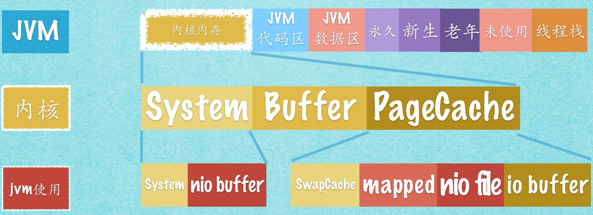
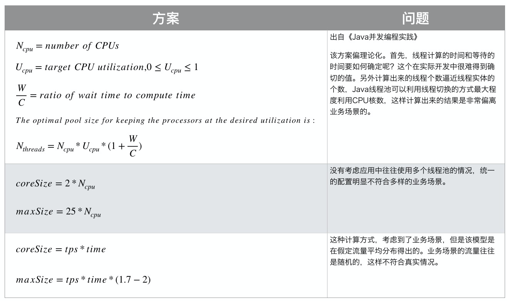

# Java Concurrency

### 多线程

*   多任务（multitasking）指的是一个CPU“同时”并发执行多个不同的任务
    *   
*   多线程（multithreading）指的是一个CPU可以“同时”并发执行多个不同的线程
    *   
    *   上图中，蓝框代表一个进程，里面的绿框代表线程；其中两个绿框线程就好比是一个音乐app，一个网络读歌曲数据，一个同事进行播放
*   多线程的好处
    *   更好的CPU使用率
        *   
        *   在IO间隙，可以使用CPU运行其他任务
    *   更好的IO使用率
        *   
        *   可以让多个线程充分利用IO资源
    *   更好的应用响应速度
        *   例如当需要一些耗时操作时，主应用线程可以fork出子线程去处理耗时任务，这样就不会导致主应用卡顿了


### 并发模型

*   并发处理（Parallel Workers）模型
    *   
    *   由委托者（delegator）向处理者（worker）分发任务，每个worker独自完成整个任务的各个流程
    *   缺点：
        *   状态共享比较麻烦；如果访问一个共享资源，则可能会因为需要并发访问共享资源，导致整体流程变慢；同时也要控制并发访问（比如需要加锁），比较麻烦
        *   无法控制任务间执行的先后顺序
*   装配线（Assembly Line）模式
    *   
    *   
    *   类似工厂装配线，每个worker负责一个环节（例如汽车工厂，喷漆、装轮胎等环节）
    *   装配线模式常被称作事件驱动模型（Event-driven）
        *   
        *   Worker之间使用channel进行通信
*   JDK 7 中提供了`ForkAndJoinPool`帮助实现函数并行执行；JDK 8中提供了`Streams`用于并行迭代一个大集合


### same-threading system / Multi-threaded / single-threaded concurrency

*   同线程系统（same-threading system）
    *   一个CPU只跑一个线程，无线程切换
    *   
*   多线程并发（Multi-threaded Concurrency）
    *   即一个线程只跑一个task，但是使用多个线程去并发的跑多个task，例如使用线程池
    *   缺点：多线程切换有开销；线程间共享数据时会存在 竞态条件、死锁等问题
*   单线程并发（single-threaded concurrency）
    *   即一个线程跑并发地多个task，通常使用类似Event loop那样的设计完成


### 临界区 和 竞态条件

*   临界区（critical section）是指多线程共同并发访问一个共享资源时，为保证其不会因并发访问出错，而需要保证一个时间只有一个线程访问的一块代码区域。造成这一情况的条件，就称为竞态条件（race condition）。
*   竞态条件产生问题的主要原因是 各线程并发的Check-Then-Act 或 Read-Modify-Write操作，即类似先读再改的操作
    *   
    *   类似上图中，左右两个线程同时想对 count实行++操作，然而它们同时读到了0，同时将count更新为1；这与我们期望的各+1，更新为2的结果不一致
*   预防竞态条件
    *   对临界区进行同步阻塞（加synchronized）
        *   要尽可能缩小临界区代码范围，给尽量少的对象加锁，这样才可以提升吞吐量
    *   使用原子性的对象作为临界区的共享资源


### Java内存模型

*   JVM内部模型在此不做介绍
*   JVM与外部操作系统内存模型
    *   
    *   最上方是CPU及CPU寄存器，中间隔了L1、L2、L3级缓存，最下面是我们的主内存RAM
    *   JVM的内存位于RAM上，程序会从缓存或主存中获取数据，进行处理，处理完后更新回缓存或主存
    *   因此我们是不能保证每次运算的结果都被写会主存的；Java中的volatile关键字就是为了保证该变量每次更新都被写回主存
    *   cache加载详细过程参考：https://zhuanlan.zhihu.com/p/102293437
*   JVM与Linux的内存模型
    *   
    *   从上至下，物理内存指的是RAM主存，swap指的是虚拟内存页不够时页面置换的存放位置（类似windows C盘）
    *   Linux在主存上的空间分配为图中第二级，Bin区用作系统启动时的引导，内核内存用于Linux自身内核逻辑使用，用户内存则是分配给各个在Linux上运行的进程
    *   图中第三级表示进程在Linux用户内存中的分配情况；以JVM举例 代码区和数据区对应 JVM的方法区，储存类信息和常量；堆区即JVM堆区，储存动态分配的对象；未使用区是JVM预留用于给堆区和栈区分配额外内存的；栈区即JVM的虚拟机栈区，用于储存线程局部变量，返回地址等信息
        *   
    *   此外Linux还允许进程使用内核内存或进行内核内存映射；Java里主要是Java NIO相关API会使用到这部分 直接内存
        *   
        *   使用ByteBuffer.allocateDirect()之类的方法申请获得的DirectBuffer会放在System部分；使用mmap映射的部分会被放入PageCache
        *   因此使用NIO时少了一次内核空间至用户空间的内存拷贝，性能更好


#### 伪共享

*   L1、L2 cache存在缓存行的概念：

    *   即缓存由缓存行构成，通常缓存行大小为64bytes，引用内存上的一块连续区域
    *   一个 Java 的 long 类型是 8 字节，因此在一个缓存行中可以存 8 个 long 类型的变量，如下图所示：
        *   

*   由于缓存行是一块连续区域，因此会将相邻数据一同加载进来；一般可能是连续的数组，但也有可能是两个不相干的变量值被加载进了一个缓存行

*   这一特性在并发修改情况下会导致缓存行失效，例如下图

    *   

*   变量a、b是同一缓存行，线程A修改变量a，线程B修改变量b，分别有各自核心的cache；线程A更新a，导致另外一个线程的核心的cache的缓存行（）失效

*   如何避免伪共享？

    *   padding

        *   ```Java
            class Pointer {
                MyLong x = new MyLong();
                MyLong y = new MyLong();
            }
            
            class MyLong {
                volatile long value;
                long p1, p2, p3, p4, p5, p6, p7;
            }
            ```

        *   即在value后面补7个long，占满整个缓存行

    *    @sun.misc.Contended 注解（java8）

        *   ```Java
            @sun.misc.Contended
            class MyLong {
                volatile long value;
            }
            ```

        *   默认该注解是无效的，需要在JVM启动参数加上`-XX:-RestrictContended`才会生效


------------

### Thread

*   线程状态转换：
    *   
    *   HotSpot虚拟机会将每一个Java线程直接映射到一个操作系统原生线程，即1:1映射
    *   创建没执行的时候是New状态，调用start()进入就绪状态，等待CPU调度进入Running状态
        *   start()和run()的区别：start()是将线程从New状态进入就绪状态，run()则是runnable接口的实现方法，是该线程在被调度时执行的逻辑
    *   blocked和waiting状态的区别主要是 waiting是在WaitSet里，而blocked是在EntrySet里；WaitSet里的线程需要被其他线程notify()才能进入EntrySet，而WaitSet中的线程可在其他线程释放锁后，直接参与竞争，进入Running状态
        *   sleep和wait的区别主要是：均会放弃CPU，但sleep不会放弃锁，sleep的时间结束后被自动唤醒


### Volatile关键字

*   volatile可以保证

    *   可见性（visibility guarantee）

        *   即确保每次会更新到主存而不只是CPU cache

    *   一定程度的有序性（Happens-before guarantee）

        *   为提升程序执行效率，CPU执行时往往会对指令进行重排序（reordering）

        *   

        *   如上图，没有依赖关系的多条指令可以调整顺序并分成组进行并行执行，这一过程叫做重排序

        *   重排序不会影响单线程程序执行的结果，但却可能会影响到多线程程序的结果

            *   ```Java
                public class FrameExchanger  {
                    private long framesStoredCount = 0:
                    private long framesTakenCount  = 0;
                
                    private boolean hasNewFrame = false;
                    private Frame frame = null;
                
                    // called by Frame producing thread
                    public void storeFrame(Frame frame) {
                        this.frame = frame;
                        this.framesStoredCount++;
                        this.hasNewFrame = true;
                    }
                
                    // called by Frame drawing thread
                    public Frame takeFrame() {
                        while( !hasNewFrame) {
                            //busy wait until new frame arrives
                        }
                
                        Frame newFrame = this.frame;
                        this.framesTakenCount++;
                        this.hasNewFrame = false;
                        return newFrame;
                    }
                }
                ```

            *   这段代码表示一个线程会调用storeFrame方法，来存储Frame；而另一个线程会调用takeFrame方法，取走Frame

            *   然而storeFrame方法中，由于三个赋值操作在CPU看来可以进行重排序；因而有可能执行顺序如下

                *   ```Java
                    public void storeFrame(Frame frame) {
                      this.hasNewFrame = true;
                      this.framesStoredCount++;
                      this.frame = frame;
                    }
                    ```

            *   那么在takeFrame线程可能会在frame还是null的时候，进行takeFrame操作，导致程序正确性出现问题

        *   volatile关键字可以防止该变量在的指令进行重排序；例如上面的storeFrame方法，可以保证`this.hasNewFrame = true;`在最后；而前两个语句之间仍旧可以重排序

            *   ```Java
                //x、y为非volatile变量
                //flag为volatile变量
                
                x = 2;    //语句1
                y = 0;    //语句2
                flag = true; //语句3
                x = 4;     //语句4
                y = -1;    //语句5
                ```

            *   保证语句3在1、2后执行，在4、5前执行；但1、2之间和4、5之间顺序不保证，仍旧可以reordering

*   volatile无法保证原子性

    *   例如i++操作，还是分为读i，i=i+1两个阶段完成的，所以这种场景用volatile是不能保证的

*   volatile在JVM的实现

    *   多出一个lock前缀指令，相当于一个内存屏障，使
        *   它确保指令重排序时不会把其后面的指令排到内存屏障之前的位置，也不会把前面的指令排到内存屏障的后面；即在执行到内存屏障这句指令时，在它前面的操作已经全部完成；
        *   它会强制将对缓存的修改操作立即写入主存；
        *   如果是写操作，它会导致其他CPU中对应的缓存行无效

*   volatile使用场景

    *   要使 volatile 变量提供理想的线程安全，必须同时满足下面两个条件：

        -   对变量的写操作不依赖于当前值
        -   该变量没有包含在具有其他变量的不变式中

    *   状态切换

        *   ```Java
            volatile boolean inited = false;
            //线程1:
            context = loadContext(); 
            inited = true;      
            
            //线程2:
            while (!inited){
            	sleep()
            }
            doSomethingwithconfig(context);
            ```

    *   一次性安全发布（one-time safe publication）

        *   ```java
            public class Singleton {
                private volatile static Singleton uniqueSingleton;
            
                private Singleton() {
                }
            
                public Singleton getInstance() {
                    if (null == uniqueSingleton) {
                        synchronized (Singleton.class) {
                            if (null == uniqueSingleton) {
                                uniqueSingleton = new Singleton();
                            }
                        }
                    }
                    return uniqueSingleton;
                }
            }
            ```

        *   其中new Singleton()那行可以分为三步：为对象分配内存空间；初始化对象；将引用指向对象所在的内存空间

        *   这个三个步骤可能会产生重排序，导致多线程情况下，访问到一个未完成初始化的对象

        *   加volatile就是为了取消重排序

    *   多读-少写（例如一写多读） 场景的性能优化

        *   ```Java
            @ThreadSafe
            public class CheesyCounter {
                // Employs the cheap read-write lock trick
                // All mutative operations MUST be done with the 'this' lock held
                @GuardedBy("this") private volatile int value;
             
                //读操作，没有synchronized，提高性能
                public int getValue() { 
                    return value; 
                } 
             
                //写操作，必须synchronized。因为x++不是原子操作
                public synchronized int increment() {
                    return value++;
            	  }
            }
            ```

        *   使用 `synchronized` 确保增量操作是原子的，并使用 `volatile` 保证当前结果的可见性。


### Synchronized

*   目的：保证在临界区同时只有一个线程执行（互斥锁）；同时synchronized也能保证volatile的那些可见性、有序性（但不能保证不会进行指令重排，只是因为相当于单线程执行了，指令重排也不会影响结果）特性

*   synchronized锁什么对象

    *   实例方法 -> 锁this，即当前对象
    *   static方法 -> 锁当前类的Class实例
    *   代码块 -> 锁括号里的对象实例

*   ```Java
    public class SynchronizedTest {
    
        public synchronized void doSth(){
            System.out.println("Hello World");
        }
    
        public void doSth1(){
            synchronized (SynchronizedTest.class){
                System.out.println("Hello World");
            }
        }
    }
    
    +++++++++++++++++++++++++++++++++++++++ After Decompilation +++++++++++++++++++++++++++++++++++++++
    
    public synchronized void doSth();
        descriptor: ()V
        flags: ACC_PUBLIC, ACC_SYNCHRONIZED
        Code:
          stack=2, locals=1, args_size=1
             0: getstatic     #2                  // Field java/lang/System.out:Ljava/io/PrintStream;
             3: ldc           #3                  // String Hello World
             5: invokevirtual #4                  // Method java/io/PrintStream.println:(Ljava/lang/String;)V
             8: return
    
      public void doSth1();
        descriptor: ()V
        flags: ACC_PUBLIC
        Code:
          stack=2, locals=3, args_size=1
             0: ldc           #5                  // class com/hollis/SynchronizedTest
             2: dup
             3: astore_1
             4: monitorenter
             5: getstatic     #2                  // Field java/lang/System.out:Ljava/io/PrintStream;
             8: ldc           #3                  // String Hello World
            10: invokevirtual #4                  // Method java/io/PrintStream.println:(Ljava/lang/String;)V
            13: aload_1
            14: monitorexit
            15: goto          23
            18: astore_2
            19: aload_1
            20: monitorexit
            21: aload_2
            22: athrow
    ```

    *   synchronized修饰同步方法时
        *   JVM采用隐式的`ACC_SYNCHRONIZED`标记符来实现同步，而不是在指令执行时显式地增加 `monitorenter/monitorexit` 命令
        *   线程访问某个方法时，会先在方法区检查该方法是否有`ACC_SYNCHRONIZED`标记；有标记则会先去获取monitor锁，获取到则执行，获取不到则阻塞
    *   synchronized修饰代码块时
        *   JVM采用**「monitorenter、monitorexit」**两个指令来显示地实现同步
        *   每个对象维护着一个monitor锁计数器，`monitorenter`相当于加锁，`monitorexit`相当于解锁；加锁对计数器加1，解锁对计数器减1；减到0时释放锁；不同线程`monitorenter`时会被阻塞
        *   因此我们说synchronized是可重入锁

*   JVM中，实例数据会被存储在heap，而Class类对象及元数据等会被存在方法区（实例引用存在栈）

    *   方法区每个对象的Class信息包含 实例数据、对象头 和 对齐填充 三部分
        *   实例数据：存放类的属性数据信息，包括父类的属性信息
        *   对象头：存放mark_word标记数据
            *   mark_word中就存放了指向该对象对应的monitor实例的指针

*   一个对象会关联一个monitor对象：

    *   ```C++
          ObjectMonitor() {
            _header       = NULL;
            _count        = 0;
            _waiters      = 0,
            _recursions   = 0;
            _object       = NULL;
            _owner        = NULL;
            _WaitSet      = NULL;
            _WaitSetLock  = 0 ;
            _Responsible  = NULL ;
            _succ         = NULL ;
            _cxq          = NULL ;
            FreeNext      = NULL ;
            _EntryList    = NULL ;
            _SpinFreq     = 0 ;
            _SpinClock    = 0 ;
            OwnerIsThread = 0 ;
          }
        ```

    *   当多个线程同时访问一段同步代码时，首先会进入`_EntryList`队列中，当某个线程获取到对象的monitor后进入`_Owner`区域并把monitor中的`_owner`变量设置为当前线程，同时monitor中的计数器`_count`加1。即获得对象锁。

    *   若持有monitor的线程调用`wait()`方法，将释放当前持有的monitor，`_owner`变量恢复为`null`，`_count`自减1，同时该线程进入`_WaitSet`集合中等待被唤醒。若当前线程执行完毕也将释放monitor(锁)并复位变量的值，以便其他线程进入获取monitor(锁)。

*   这样的实现是要将线程直接映射到操作系统的原生线程上的，那么在切换时就要反复进行用户态内核态切换，性能不好（特别是单单的get/set方法，出现这一情况就有点捞）；所以此种实现的synchronized，我们一般说是重量级锁

*   针对这一问题，JDK 6以后，进行了优化

    *   初始情况下，对象的mark word将被标记为无锁状态（01）
    *   当仅有一个线程申请加锁时，会将被锁对象的mark word的偏向模式通过CAS操作标记为1，同时记录线程ID；此时进入偏向锁模式，即虚拟机总是会偏向给这个线程锁；如果这两个修改的CAS操作都成功，那么偏向锁就加锁成功；因为仅有一个线程，所以可以不使用任何加锁的同步措施
    *   一旦出现另外一个线程尝试获取这个对象的锁，那么就会将锁升级为轻量锁
        *   进入同步块前，先在运行线程的线程栈中建立一个Lock Record，然后将对象mark word的一份拷贝加上一个displaced header存入lock record
            *   
            *   
        *   然后虚拟机尝试用CAS操作将mark word更新为指向该线程lock record的指针；如果操作成功，即代表此线程拥有该对象的锁，同时mark word的最后两位会变成00
        *   解锁过程即 检查当前mark word指向的线程是否是自身线程的lock record，那么就进行CAS将displaced mark word复制回原mark word（替换），如果cas操作成功了，即解锁成功
    *   如果有超过两个线程同时访问，那么轻量级锁将膨胀为传统的基于monitor的重量级锁


### 锁


#### 公平锁、非公平锁

*   线程饥饿问题：指某个线程因为所需要的资源被其他线程占用而得不到CPU调度，一般由以下原因引起
    *   一直被高优先级线程抢占CPU
    *   某些线程频繁重入锁，一直不释放锁
    *   调用wait()后一直未被唤醒
*   公平性：指所有线程都有机会被CPU进行调度，而不会出现饥饿问题
*   Java中
    *   公平锁：按FIFO的顺序进行调度
    *   非公平锁：不按先来后到顺序，有可能后来的先被调度


#### 乐观锁、悲观锁

*   乐观锁：即乐观地假设线程之间不会发生并发修改，然后在进行修改时，再进行确认没有发生并发修改，发生了则当前修改提交失败
    *   优势：因为不事先加锁，冲突少的情况下性能会好；然后也不会发生死锁；并发冲突的情况下，可能反而会反复修改失败，性能降低
    *   使用场景：高访问量，较少冲突可能性的场景
*   悲观锁：即悲观的假设每次线程都有可能发生并发修改，强制先上锁再修改，是一种较为保守的策略
    *   优势：稳定，确保修改时一定只有一个线程，在冲突多的情况下表现较优
    *   使用场景：并发冲突多的场景

#### 无锁、偏向锁、轻量级锁、重量级锁

对象mark_word（64bit）里的锁状态记录了这四种锁状态。


| 锁状态   | 存储内容                                                |
| :------- | :------------------------------------------------------ |
| 无锁     | 对象的hashCode、对象分代年龄、是否是偏向锁（0）         |
| 偏向锁   | 偏向线程ID、偏向时间戳、对象分代年龄、是否是偏向锁（1） |
| 轻量级锁 | 指向栈中锁记录的指针                                    |
| 重量级锁 | 指向互斥量（重量级锁）的指针                            |

*   无锁（unblocked）：无锁状态下可尝试加锁（标识01）
*   偏向锁（biased locked）：当只有一个线程加锁时，通过设置偏向标示（即总是偏向给该线程锁），消除该线程的所有加解锁，以提升性能（偏向标示为1）
    *   如果某对象大部分情况都是多线程访问的，那用偏向锁就反而不好
*   轻量级锁（light-weight locked）：当只有两个线程加锁时，使用CAS操作进行竞争（详见synchronized优化过程）（标识00）
*   重量级锁（heavy-weight locked）：当有超过两个线程竞争该对象时，会升级为传统的monitor锁（标识10）

详见Synchronized的锁升级过程

#### 可重入锁、非可重入锁

*   可重入锁指的是当前线程持有锁的情况下可以再获取锁，然后将锁计数加一；释放锁可将锁计数减一，计数减到0后，才会释放锁

#### 共享锁、排他锁	

*   共享锁即读锁（S锁），排他锁即写锁（X锁）

#### 自旋锁、适应性自旋锁


*   自旋锁（SpinLock）：在尝试获取锁失败后，线程进行循环检查锁是否可用，而不是进入阻塞状态的一种锁
    *   适用场景：对于阻塞时间很短的场景，由于线程切换的成本过高，有时忙等待一会儿反而会更节省CPU和空间资源；自旋锁就是适应这种场景
    *   优势：不会进行线程切换，没有线程切换的损耗
    *   劣势：由于忙等待期间仍是消耗CPU的，因此对于阻塞时间长的应用，反而是浪费资源
    *   一般会控制自旋几次，然后再挂起；Java中也是用CAS实现的
*   适应性自旋锁：即根据当前情况动态调整自旋次数，而不是固定次数

#### 锁消除、锁粗化

首先看我们的例子：

```Java
public String concatString(String s1, String s2, String s3) { 
    StringBuffer sb = new StringBuffer();
    sb.append(s1);
    sb.append(s2);
    sb.append(s3);
    return sb.toString(); 
}
```

表面上看起来，上述的方法没有任何上锁的逻辑，然而实际上StringBuffer的append方法是加了synchronized关键字的

```Java
 public final class StringBuffer {
 		... ...
 		
		@Override
    public synchronized StringBuffer append(CharSequence s) {
        toStringCache = null;
        super.append(s);
        return this;
    }
    
    ... ...
}
```

*   锁消除（Lock Elimination）
    *   编译器在运行时，检测到一些代码要求了同步（加了synchronized），但实际上该对象上完全不可能出现同步竞争；此时考虑不可能出现并发问题，因此会进行消除锁
        *   锁消除的主要判定依据来源于逃逸分析（Escape Analysis）的数据支持；
            *   线程逃逸指的是 一个对象在定义后，被其他方法（方法逃逸）或其他线程（线程逃逸）所引用
            *   逃逸分析即分析各变量的逃逸情况
            *   好处：可以根据逃逸分析结果，将从不逃逸的堆中变量转移到栈上，减轻GC；也可以进行锁消除
        *   锁消除即在 逃逸分析后，发现sb变量只被限制在该方法内，其他线程无法访问，因此可以在编译时便消除锁
*   锁粗化（Lock Coarsening）
    *   在编写代码的时候，一般总是推荐将同步块的作用范围限制得尽量小；只在需要操作shared object时再进行同步加锁
    *   然而在连续的操作都对同一个对象时，就会导致不必要的线程同步消耗
    *   例如上述方法，编译器会可以考虑将所有append的synchronized块合并为1个，这样加锁一次就OK


### CAS

*   CAS（compare and swap），是Java中对乐观锁的一种实现方式，是一种无锁算法；即乐观锁在提交修改时判断共享变量是否遭遇并发修改的一种机制
*   CAS实现：
    *   三个参数：一个当前变量内存地址上的值 V、旧的预期值 A、即将更新的值 B
    *   什么情况下能够提交修改：当且仅当预期值 A 和内存值 V 相同时，将内存值修改为 B ，并返回 true；否则不做修改，返回 false
    *   具体用unsafe方法调用C++实现
*   CAS的缺陷：
    *   ABA问题：可能其他线程在同一时刻先将锁变量改为B，又改回了A；实际上是发生了并发修改，但结果上看不出来
        *   解决：JDK 5提供了`AtomicStampedReference`类，通过记录数据版本来进行控制；但是这种方式会降低性能，使用时建议和传统加锁的性能进行比较
    *   修改失败时可能会循环这一操作，然后循环失败，就相当于死循环了，十分耗CPU（类似自旋的情况）
        *   解决：类似自旋锁的解决，设一个最大次数的限制


### 死锁

*   死锁指多个线程竞争相同资源导致循环等待的情况
*   死锁的四个必要条件
    *   互斥
    *   占有且等待（等待时会继续占有资源）
    *   不可抢占
    *   循环等待
*   死锁预防的方法
    *   加锁时有timeout（超过时间就放弃，并释放已有资源的锁）
    *   控制加锁顺序
    *   死锁检测（维护一个图，防止出现循环等待的情况）


### ThreadLocal

*   为每个线程绑定一个变量，使每个线程只对自己的变量进行读写

*   ```Java
    // 成员变量
    private ThreadLocal threadLocal = new ThreadLocal();
    
    // set
    threadLocal.set("A thread local value");
    
    // 之后调get就行
    String threadLocalValue = (String) threadLocal.get();
    
    // 不想用了可以remove
    threadLocal.remove();
    
    // 创建时为每个线程设置初始值
    private ThreadLocal myThreadLocal = new ThreadLocal<String>() {
        @Override protected String initialValue() {
            return String.valueOf(System.currentTimeMillis());
        }
    };    
    ```

*   底层实现：

    *   ```Java
        public class Thread implements Runnable {
        	... ...
        
            /* ThreadLocal values pertaining to this thread. This map is maintained
             * by the ThreadLocal class. */
            ThreadLocal.ThreadLocalMap threadLocals = null;
        
            /*
             * InheritableThreadLocal values pertaining to this thread. This map is
             * maintained by the InheritableThreadLocal class.
             */
            ThreadLocal.ThreadLocalMap inheritableThreadLocals = null;
          
          ... ...
        ```

    *   Thread类里面维护了一个变量`ThreadLocal.ThreadLocalMap threadLocals`用于持有该线程的threadlocalMap

    *   threadlocalmap是一个弱引用（WeakReference）HashMap，Map的key为ThreadLocal实例，value为当前Thread在该ThreadLocal对象上保存的变量（一个线程可能在多个类上都有用到不同的ThreadLocal变量，所以用一个Map加以区分）

    *   threadlocalmap的弱引用是key（对ThreadLocal）的弱引用，而Value保存的Object仍是强引用，因此GC可能会出现\<null, obj\>的Map Entry，所以可能会导致内存泄漏（一般称 程序未能释放已经不再使用的内存 这种情况叫内存泄漏）

        *   ```Java
            static class ThreadLocalMap {
                static class Entry extends WeakReference<ThreadLocal<?>> {
                    /** The value associated with this ThreadLocal. */
                    Object value;
            
                    Entry(ThreadLocal<?> k, Object v) {
                        super(k);
                        value = v;
                    }
                }
                ... ...
            ```

        *   解决：在调用set() get() remove()时会自动清理null键

*   适用场景：每个线程需要一个独立的变量以在多个方法内共享的情况

    *   数据库连接池
    *   Session


### ReentrantLock的区别


#### AQS（AbstractQueuedSynchronizer）

*   核心是维护一个state和一个FIFO队列，先通过CAS修改state来获取锁；获取失败则放入FIFO队列队尾
*   独占模式，即state只有0和1，CAS成功则获得锁，失败则排队，解锁时公平模式使队首获得锁，或非公平情况直接抢占；共享模式，state会有正数值，解锁则state减一，根据具体适用情况确定

https://www.cnblogs.com/wang-meng/p/12816829.html


### wait / notify / notifyAll

*   wait / notify / notifyAll 均为Object对象的方法，需要与Synchronized搭配使用
*   调用wait()方法会释放该线程对该对象的monitor锁，然后将其加入waitSet队列中
*   调用notify()方法会将一个waitSet中的线程加入到EntrySet；而调用notifyAll()会将所有waitSet中的线程加入到EntrySet；之后竞争锁，出现下一个执行临界区的线程
*   以上过程结合这个图理解
    *   
*   wait / notify / notifyAll 的主要好处是：避免那种用一个boolean flag来写`while(!flag){}`的长时间耗CPU的轮询操作，这样直接可以线程切换，减少这方面CPU的浪费
*   为什么现在不建议使用 wait / notify / notifyAll
    *   Condition类
*   为什么必须在synchronized中使用？
    *   因为必须持有锁才可以调wait()释放锁，而且也都是基于monitor实现的
    *   在synchronized外使用，会报`IllegalMonitorStateException`异常
*   和Thread.sleep()的区别
    *   虽然都是使线程阻塞，但是sleep不释放锁
*   为什么wait / notify / notifyAll 在Object中实现？
    *   因为也是使用的monitor，都是针对对象加锁，要和对象进行关联


#### Condition

*   ReentrantLock提供的一种notify/wait方法

    *   ```Java
        		{
                ReentrantLock lock = new ReentrantLock();
                Condition condition = lock.newCondition();
                Thread thread = new Thread(() -> {
        
                    lock.tryLock();
                    try {
                        System.out.println("wait signal");
                        condition.await();
                    } catch (InterruptedException e) {
                        e.printStackTrace();
                    }
                    System.out.println("got signal");
                    lock.unlock();
                });
        
                Thread thread2 = new Thread(() -> {
        
                    lock.tryLock();
                    System.out.println("i got the lock");
                    try {
                        TimeUnit.SECONDS.sleep(1);
                        condition.signal();
                        System.out.println("i send a signal");
                    } catch (InterruptedException e) {
                        e.printStackTrace();
                    }
                    lock.unlock();
                });
        
                thread.start();
                TimeUnit.MILLISECONDS.sleep(10);
                thread2.start();
                TimeUnit.SECONDS.sleep(2);
            }
        ```

*   每个newCondition()方法会在AQS创建一个condition队列

*   与Object的notify/wait方法区别

    *   condition支持多个condition等待队列
    *   Condition支持不响应中断
    *   notify/wait方法需要monitor支持


### Fork / Join

*   分治

*   工作窃取算法


#### ConcurrentHashMap

*   JDK 1.7 前使用分段锁，即把hash table分成一些小段，然后每次锁（用Reentrantlock锁）一段
    *   由于多个分段锁会占用一定的内存空间，并且实际测试发现map在放入时竞争一个分段锁的概率较低，因而放弃
*   JDK 1.8 重新使用 synchronized + CAS + 普通hashmap底层结构（较少冲突则链表存储，冲突过多则 转红黑树）
    *   加锁的时候锁住每个hash桶的头节点 或 红黑树的根节点（粒度更细）
        *   
    *   具体流程：
        *   根据 key 计算出 hash 值；
        *   判断是否需要进行初始化；
        *   定位到 Node，拿到首节点 f，判断首节点 f：
            *   如果为 null ，则通过 CAS 的方式尝试添加；
            *   否则 ，synchronized 锁住 f 节点，判断是链表还是红黑树，遍历插入；


#### CopyOnWriteArrayList

*   写时复制容器，即写的时候会复制一个副本，在副本上写完再替换原数据
*   写的时候还是会加锁的，因为要防止多线程修改，复制N个副本的情况
*   读可以直接读，不用进行同步，但有一定一致性问题（修改不能马上看到）
*   适用场景：读多写少的场景，例如配置、黑名单、物流地址等信息
*   缺点：内存占用和数据一致性问题


#### 阻塞队列

*   阻塞队列在队列为空时，获取元素会被阻塞；队列满时，添加元素会被阻塞
*   Java ArrayBlockingQueue底层用ReentrantLock的Condition实现；分别为 notEmpty和notFull定义两个Condition，然后来notify和await


#### Atomic类

*   满足原子性的基本类型，自带一些自增之类的方法
*   底层使用CAS实现


#### CountDownLatch & CyclicBarrier

*   CountDownLatch，用于一个主方法等待多个子过程全部完成后再继续执行的场景：

    *   ```Java
        public class CountDownLatchTest {
        	// 自定义工作线程
        	private static class Worker extends Thread {
        		private CountDownLatch countDownLatch;
        		
        		public Worker(CountDownLatch countDownLatch) {
        			this.countDownLatch = countDownLatch;
        		}
        		
        		@Override
        		public void run() {
        			super.run();
        			
        			try {
        				countDownLatch.await();
        				System.out.println(Thread.currentThread().getName() + "开始执行");
        				// 工作线程开始处理，这里用Thread.sleep()来模拟业务处理
        				Thread.sleep(1000);
        				System.out.println(Thread.currentThread().getName() + "执行完毕");
        			} catch (Exception e) {
        				e.printStackTrace();
        			}
        		}
        	}
        	
        	public static void main(String[] args) throws InterruptedException {
        		CountDownLatch countDownLatch = new CountDownLatch(1);
        		
        		for (int i = 0; i < 3; i++) {
        			System.out.println("创建工作线程" + i);
        			Worker worker = new Worker(countDownLatch);
        			worker.start();
        		}
        		
        		// 工作线程需要等待主线程准备操作完毕才可以执行，这里用Thread.sleep()来模拟准备操作
        		Thread.sleep(1000);
        		System.out.println("主线程准备完毕");
        		
        		countDownLatch.countDown();
        	}
        }
        ```

*   CyclicBarrier 用于多个线程一起执行，先完成的线程阻塞，然后当这一组线程全部执行完毕后，才会全部打开

    *   ```Java
        public class CyclicBarrierTest {
        	// 自定义工作线程
        	private static class Worker extends Thread {
        		private CyclicBarrier cyclicBarrier;
        		
        		public Worker(CyclicBarrier cyclicBarrier) {
        			this.cyclicBarrier = cyclicBarrier;
        		}
        		
        		@Override
        		public void run() {
        			super.run();
        			
        			try {
        				System.out.println(Thread.currentThread().getName() + "开始等待其他线程");
        				cyclicBarrier.await();
        				System.out.println(Thread.currentThread().getName() + "开始执行");
        				// 工作线程开始处理，这里用Thread.sleep()来模拟业务处理
        				Thread.sleep(1000);
        				System.out.println(Thread.currentThread().getName() + "执行完毕");
        			} catch (Exception e) {
        				e.printStackTrace();
        			}
        		}
        	}
         
        	public static void main(String[] args) {
        		int threadCount = 3;
        		CyclicBarrier cyclicBarrier = new CyclicBarrier(threadCount);
        		
        		for (int i = 0; i < threadCount; i++) {
        			System.out.println("创建工作线程" + i);
        			Worker worker = new Worker(cyclicBarrier);
        			worker.start();
        		}
        	}
        }
        ```


#### Semaphore

*   信号量（Semaphore），用于控制同一时间最多有多少个线程能够获取资源

    *   ```Java
        public static void main(String[] args) {
        		Semaphore semaphore = new Semaphore(3);
        
        		for (int i = 0; i < 5; i++) {
        			new Thread(new Runnable() {
        				@Override
        				public void run() {
        					try {
        						semaphore.acquire();//申请资源
        						System.out.println(Thread.currentThread().getName()+"抢到车位");
        						ThreadUtil.sleep(RandomUtil.randomInt(1000,5000));
        						System.out.println(Thread.currentThread().getName()+"归还车位");
        					} catch (InterruptedException e) {
        						e.printStackTrace();
        					}finally {
        					    //释放资源
        						semaphore.release();
        					}
        
        				}
        			},"线程"+i).start();
        		}
        	}
        ```

    *   Semaphore设为3，然后起了5个线程acquire这个semaphore，每一时刻最多有3个线程可以获取成功

*   内部基于AQS实现，有公平和非公平两种实现模式

    *   AQS的state为0表示没有线程占用，为正数表示semaphore当前已重入次数

    *   非公平

        *   ```Java
            final int nonfairTryAcquireShared(int acquires) {
              for (;;) {
                int available = getState();
                int remaining = available - acquires;
                if (remaining < 0 ||
                    compareAndSetState(available, remaining))
                  return remaining;
              }
            }
            ```

        *   即即刻尝试占用锁，而不管AQS中的队列

    *   公平

        *   ```Java
            protected int tryAcquireShared(int acquires) {
              for (;;) {
                if (hasQueuedPredecessors())
                  return -1;
                int available = getState();
                int remaining = available - acquires;
                if (remaining < 0 ||
                    compareAndSetState(available, remaining))
                  return remaining;
              }
            }
            ```

        *   即先检查队列中前面是否有线程，没有才去占用

### 线程池

*   线程池与连接池非常类似，通过创建一系列线程，执行完任务后不销毁而是直接返回池内，从而减少线程创建、线程销毁带来的性能损耗

*   执行过程

    *   
    *   线程池内部主要分为两部分 Task 和 Worker
    *   Task主要是用一个阻塞队列（`BlockingQueue<Runnable>`）作为任务队列；Worker主要是用于从阻塞队列中获取task并执行
        *   如果workerCount < corePoolSize，则创建并启动一个worker来执行新提交的Task。
        *   如果workerCount >= corePoolSize，且线程池内的阻塞队列未满，则将Task添加到该阻塞队列中。
        *   如果workerCount >= corePoolSize && workerCount < maximumPoolSize，并且线程池内的阻塞队列已满，则创建并启动一个Worker来执行新提交的任务；将maximumPoolSize设置成和corePoolSize一样时，就是fixedThreadPool就是 corePoolSize  = maximumPoolSize
        *   如果workerCount >= maximumPoolSize，并且线程池内的阻塞队列已满, 则根据拒绝策略来处理该任务, 默认的处理方式是直接抛异常
    *   Worker在执行完初始任务后，会不断轮询，调用getTask()获取阻塞队列内的新任务并执行

*   主要参数

    *   corePoolSize ： 核心线程数目。当当前worker数量少于 corePoolSize 时，线程池每次新执行任务时会新建worker直到树目达到 corePoolSize 为止
    *   maximumPoolSize ：线程池最大线程数量。当阻塞队列为有界队列时，如果队列满了，且task总数小于maximumPoolSize，线程池就会新建worker；若阻塞队列是无界队列，则不生效
    *   keepAliveTime ：Worker空闲时的存活时间；在worker数大于corePoolSize时，超过这个时间未执行的空闲线程将会被终止
    *   workQueue ：指定阻塞队列。ArrayBlockingQueue，LinkedBlockingQueue，SynchronousQuene，PriorityBlockingQuene
    *   defaultHandler ：拒绝策略
    *   ThreadFactory ：线程工厂

*   拒绝策略

    *   丢弃抛异常
    *   丢弃不抛异常
    *   丢掉队首
    *   由调用线程处理

*   主要线程池类型

    *   FixedThreadPool：
        *   corePoolSize = maximumPoolSize；keepAliveTime无效；阻塞队列为无界队列LinkedBlockingQueue（可能会OOM）
        *   适合CPU密集型任务
    *   CachedThreadPool
        *   corePoolSize  = 0， maximumPoolSize = Integer.MAX_VALUE； 阻塞队列是SynchronousQueue；keepAliveTime 为 60s
        *   因为corePoolSize为0，因此每提交一个任务必然会创建新的Worker（前提是SynchronousQueue此时没有空闲任务）；执行完任务的worker，由于keepAliveTime的设定，还可以空闲60s，才会被销毁
        *   SynchronousQueue是一种每一次put()操作必须等待另一个take()操作才能完成，反之亦然
    *   SingleThreadPool：即大小为1的fixedThreadPool
    *   ScheduledThreadPool
        *   阻塞队列是DelayedWorkQueue；keepAliveTime为0；主要功能是可以以一定周期定期执行Task，Worker只会从 DelayQueue 中获取 time 大于等于当前时间的task，执行完后会放回

*   提交Task的方式：execute()和submit()；区别在于submit()可以返回Future\<T\>，execute()无返回值

*   线程池参数配置

    *   
    *   但方案都偏理论，建议结合具体情况分析；对于IO密集的，可适当调大线程数；对于CPU密集型的，建议1:1分配CPU核心，从而减少线程切换的消耗

*   线程池关闭

    *   shutdown()会中断空闲worker，然后等所有正在运行的worker执行完毕再关闭

    *   shutdownNow()会立即中断所有Worker

    *   一般正确的线程池关闭方式如下

        *   ```Java
            executorService.shutdown();
            try {
               // 等待 60 s
              if (!executorService.awaitTermination(60, TimeUnit.SECONDS)) {
                // 调用 shutdownNow 取消正在执行的任务
                executorService.shutdownNow();
              }
            } catch (InterruptedException e) {
              e.printStackTrace();
            }
            ```

        *   即shutdown()后调用awaitTermination()等待一段时间，如果不行再shutdowNow()


https://www.pdai.tech/md/java/thread/java-thread-x-juc-executor-ThreadPoolExecutor.html


### 守护线程


