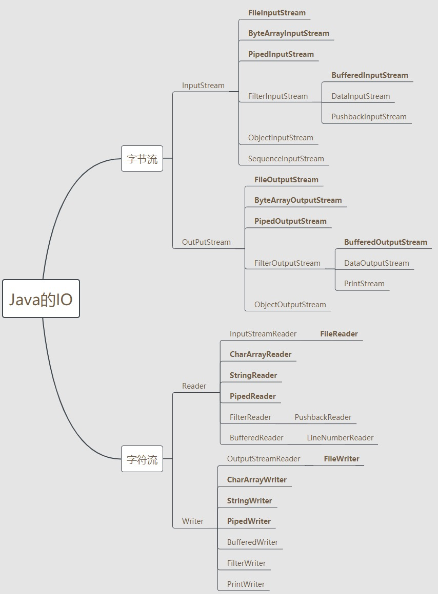
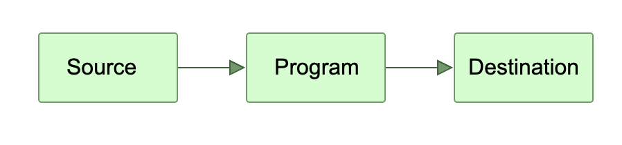
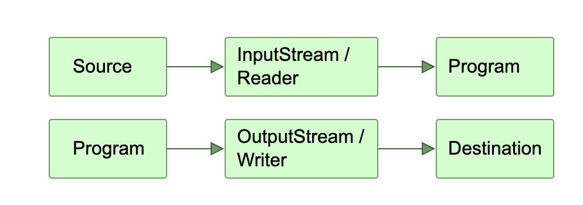
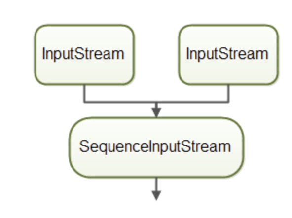
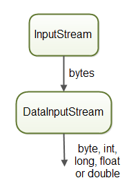
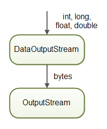

# IO Class

## 概述



Java IO完成的事情主要是：从一个source将raw data读入 或 将raw data写入一个destination；



Java中的IO类具体分为两类：byte-based（InputStream & OutputStream）和 character-based（Reader & Writer）



Java IO的source和destination主要分为以下几种：

-   File
    -   `FileInputStream` / `FileOutputStream`
        -   基于字节
    -   `FileReader` / `FileWriter`
        -   基于字符
    -   `RandomAccessFile` 提供随机访问
-   Pipe：pipe提供了运行在同一个 JVM 中的两个线程之间通信的能力
    -    `PipedOutputStream` & `PipedInputStream`
    -   由于是阻塞IO，要注意死锁问题
-   Network Connections
-   In-memory Buffers (e.g. arrays)
    -    `ByteArrayInputStream` /  `ByteArrayOutputStream`：针对 `byte[]`
    -    `CharArrayReader` /  `CharArrayWriter`：针对`char[]`
-   System.in, System.out, System.error
    -   均为JVM启动时自带的，是`java.lang.System`的static成员
    -   System.in是一个InputStream，System.out和System.error是 PrintStream


-----

### File

*   用于访问OS的文件，涉及以下功能
    *   检查文件或目录是否存在
    *   创建一个目录
    *   读取文件的长度
    *   重命名或移动文件
    *   删除一个文件
    *   检查路径是文件还是目录
    *   读取目录下的文件列表


### Serializable接口

*   是一个marker interface
*   `serialVersionUID` 变量是用于标记Class版本的，这样可以使反序列化时能够知道反序列化出来的类是不是一个版本的；
    *   一般设为 private static final long
    *   一般在类文件有较大改动时，建议修改`serialVersionUID`
*   由于现在java序列化很多都不使用Java自带的序列化了（JSON，protobuf等），因此其实`serialVersionUID`也可以选择性设置（甚至也可以选择性实现Serializable接口）


-----


流（Stream）一般代表连续的数据flow，只能够顺序读取；这意味着Stream没有像数组那样的index下标，也不能够来回读取。

Java中将Byte-based流定义为InputStream/OutputStream，将character-based流定义为 Reader/Writer


### InputStream

#### read() & read(byte[])

*   read()一次读一个byte，read(byte[])一次将会读byte[]大小的byte进入该byte数组

*   性能上，一次read多个byte显然会明显优于一次只read一个byte

*   可以通过BufferedInputStream来隐式buffering，从而提高性能

    *    ```java
         InputStream input = new BufferedInputStream(
                               new FileInputStream("c:\\data\\input-file.txt"),
                                 1024 * 1024        /* buffer size */
             );
         ```

#### mark() and reset()

*   有些场景下需要预读，然后再回到前面的位置进行重读（例如一个parser需要预读一些后面的内容进行判断）
*   mark()可以为当前读取位置打下一个标记，通过调用reset()可以将InputStream rewind回之前mark()的位置


### OutputStream

#### flush()

*   调用write()后，不能确保数据已经被fully written进了destination，比如 有时可能仍在OS cache中
*   flush()可以确保被flush到disk中


### FileInputStream

*   用于以byte-based InputStream的方式读取文件

*   两种constructor

    *   String

        *   ```java
            InputStream input = new FileInputStream("c:\\data\\input-text.txt");
            ```

    *   File

        *   ```java
            String path = "/home/jakobjenkov/data/thefile.txt";
            File file = new File(path);
            FileInputStream fileInputStream = new FileInputStream(file);
            ```


### FileOutputStream

#### Overwriting or Appending

一个参数的constructor是默认overwrite的；如果使用两个参数的constructor，第二个参数指定为true，则为append

```java
OutputStream output = new FileOutputStream("c:\\data\\output-text.txt"); //overwrite

OutputStream output = new FileOutputStream("c:\\data\\output-text.txt", true); //append
OutputStream output = new FileOutputStream("c:\\data\\output-text.txt", false); //overwrite
```


### RandomAccessFile

*   对一个文件提供随机访问能力的IO类，这是FileInputStream和FileOutputStream所不支持的

*   Constructor：

    *   ```java
        RandomAccessFile file = new RandomAccessFile("c:\\data\\file.txt", "rw");
        ```

    *   第二个参数表示Access Mode

        *   r：读模式
        *   rw：读写模式
        *   rwd：同步的读写模式，所有的对文件内容的更新都会被同步地写入磁盘
        *   rws：同步的读写模式，所有的对文件内容及文件metadata的更新都会被同步地写入磁盘

*   seek() & getFilePointer()

    *   seek(): 将pos移到指定byte offset，供后续read()/write()

    *   getFilePointer(): 获取当前pos

    *   ```java
        RandomAccessFile file = new RandomAccessFile("c:\\data\\file.txt", "rw");
        file.seek(200);
        long position = file.getFilePointer();
        ```


### ByteArrayInputStream / ByteArrayOutputStream

*   ByteArrayInputStream: 将一个byte[]数组转为一个InputStream：

    *   ```java
        byte[] bytes = ... //get byte array from somewhere.
        ByteArrayInputStream byteArrayInputStream = new ByteArrayInputStream(bytes);
        ```

*   ByteArrayOutputStream: 用一个OutputStream往byte[]数组里写数据

    *   ```java
        ByteArrayOutputStream byteArrayOutputStream = new ByteArrayOutputStream();
        
        // write data to byteArrayOutputStream
        byteArrayOutputStream.write(xxx);
        ... ...
        
        byte[] bytes = byteArrayOutputStream.toByteArray();
        ```


### FilterInputStream / FilterOutputStream

*   单纯是InputStream/OutputStream的Wrapper Class，没有实现任何功能
*   这个类主要是为了用作Decorator模式的abstract抽象Decorator类
    *   参考：https://www.liaoxuefeng.com/wiki/1252599548343744/1281319302594594
    *   可以观察到 `FilterInputStream ` 内部会持有一个InputStream的成员变量，即为被wrap的对象
*   其子类一般实现对InputStream的功能加强，如 压缩（GZIPInputStream），Buffering（BufferedInputStream）；相当于要增一个什么功能，就套一层


### BufferedInputStream

*   为内部的InputStream添加buffering功能，从而提高性能

*   `BufferedInputStream` 在内部创建一个字节数组，并尝试通过调用内部 InputStream 上的 `InputStream.read(byte[])` 方法来填充其内部字节数组

*   constructor

    *   ```java
        int bufferSize = 8 * 1024;
            
        BufferedInputStream bufferedInputStream = new BufferedInputStream(
                              new FileInputStream("c:\\data\\input-file.txt"),
                              bufferSize
            );
        ```

*   Buffer size的选择

    *   首先取决于当前机器每次read的block大小
        *   例如机器每次读4KB，那么buffer大小设为4KB以下 或是 大于4KB但不是4KB的倍数的值，肯定是不合适的
    *   其次考虑当前机器磁盘的cache大小
        *   有的机器在读取时会同时缓存后续的一些数据到其cache中
        *   那么这时候一次把这些cache里的数据都读完显然是更好的选择
    *   总结：设为 机器每次read的block大小 和 机器磁盘cache大小 的倍数，通过测试得到最佳配置

*   `BufferedInputStream` 支持 mark()和reset()方法

*   缺点：

    *   不能够被重用；如果有很多个文件，那么每个文件都需要创建这么一个BufferedInputStream，相当于每个文件都要创建一个内部的buffer字节数组，这可能会造成比较大的GC压力
    *   解决：写一个可以替换被wrap的内部InputStream成员的`ReusableBufferedInputStream` 类，从而进行复用


### BufferedOutputStream

类似BufferedInputStream，用一个内部byte数组进行统一连续写


### PushbackInputStream

*   允许在read后push back一些byte回到原Stream

*   实现上也是指定了一个内部buffer字节数组

*   ```
    // 指定push back最多8个字节
    int pushbackLimit = 8;
    PushbackInputStream input = new PushbackInputStream(
                                    new FileInputStream("c:\\data\\input.txt"),
                                    pushbackLimit);
    ```


### SequenceInputStream

*   组合多个InputStream，达到读完第一个Stream，读第二个Stream，...，直到读完最后一个Stream

    *   

*   组合多个Stream

    *   ```java
        InputStream input1 = new FileInputStream("c:\\data\\file1.txt");
        InputStream input2 = new FileInputStream("c:\\data\\file2.txt");
        InputStream input3 = new FileInputStream("c:\\data\\file3.txt");
        
        Vector<InputStream> streams = new Vector<>();
        streams.add(input1);
        streams.add(input2);
        streams.add(input3);
        
        SequenceInputStream sequenceInputStream = new SequenceInputStream(streams.elements()));
        ```

    *   或者调用多次组合两个Stream的constructor


### DataInputStream / DataOutputStream

*   DataInputStream 用于从InputStream中读取基本类型数据（如boolean，int，long，double）

    *   

    *   ```java
        DataInputStream dataInputStream = new DataInputStream(
                                    new FileInputStream("binary.data"));
        
        int    aByte   = input.read();
        int    anInt   = input.readInt();
        float  aFloat  = input.readFloat();
        double aDouble = input.readDouble();
        ```

*   DataOutputStream 用于向OutputStream中写入基本类型数据（如boolean，int，long，double）

    *   

### ObjectInputStream / ObjectOutputStream

*   分别用于读取和写入序列化后的 Java Object 字节流

    *   ```java
        ObjectInputStream objectInputStream =
            new ObjectInputStream(new FileInputStream("object.data"));
        
        MyClass object = (MyClass) objectInputStream.readObject();
        ```

    *   ```java
        ObjectOutputStream objectOutputStream = 
            new ObjectOutputStream(new FileOutputStream("object.data"));
        
        MyClass object = new MyClass();
        output.writeObject(object);
        ```

    *   被读写的类必须实现Serializable接口


### Reader & Writer

类似InputStream和OutputStream，只不过一次是读两个byte，也就是基本单位是char的


### BufferedReader

*   基本类似BufferedInputStream
*   额外提供readLine()方法
    *   ```String line = bufferedReader.readLine();```


### LineNumberReader

*   BufferedReader的子类，会额外记录行数，因此更方便获取行号

*   ```java
    Reader reader = new FileReader("data/text.txt");
    
    try(LineNumberReader lineNumberReader = new LineNumberReader(reader)){
    
        String line = lineNumberReader.readLine();
        while(line != null) {
            //do something with line
    
            line = lineNumberReader.readLine();
    				int lineNumber = lineNumberReader.getLineNumber();
        }
    
    }
    ```


### StreamTokenizer

*   可以对Reader进行Tokenize，例如对 “Mary had a little lamb” 根据 空格 进行tokenize，调用`StreamTokenizer`提供的`nextToken()`方法可以得到 `[Mary, had, a, little, lamb]`


### StringReader

*   类似之前的ByteArrayInputStream，和CharArrayReader，是把一个String的内容当作source，使用StringReader对其进行读取