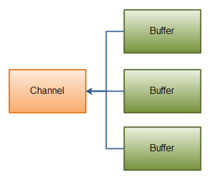

# NIO

Java NIO（New IO）提供了一系列与Java IO不同的编程模型的API，其中包括非阻塞（non-blocking）IO和阻塞IO

### NIO vs IO

| **IO**          | **NIO**         |
| --------------- | --------------- |
| Stream oriented | Buffer oriented |
| Blocking IO     | Non blocking IO |
|                 | Selectors       |

*   IO面向Stream，NIO面向Buffer
    *   面向Stream意味着你每次需要读一个或多个byte，然后读取到的数据不会被cache，不能够来回读已读到的数据（Stream流走了就没有了）
    *   面向buffer意味着数据会被缓存，可以自己控制来回读，但是需要处理一次读多了的情况（调用compact()把读多了的数据放到下次再处理）
*   IO为阻塞IO，NIO为非阻塞IO（其中的FIleChannel不是非阻塞IO）
    *   阻塞IO意味着没数据时，调用read()线程会一直阻塞直到数据到来
    *   非阻塞IO意味着在没数据时或是数据没完全写完时，不用一直idle，而是可以去处理别的事情
*   NIO的selector则是为方便处理多个非阻塞IO提供了编程支持


### 同步阻塞 vs 同步非阻塞 vs 异步非阻塞

*   同步阻塞指 一个线程读数据，数据没来，它就被block在那，直到有数据到来，期间线程不能干别的事情
*   同步非阻塞指的是 线程在没数据时不会被block（或者说不会被挂起），可以做别的事情，但是当数据来了时需要自己主动去询问数据来了没才能得知；就比如Java selector模型，需要主动去select()才能够获取到那些ready的channel
*   异步非阻塞指的是 同样线程没数据时不会被阻塞，但是数据来了可以主动通知原线程；实现上，例如ready之后主动调用原线程提供的接口

----------

### NIO基本编程模型

NIO基本上由Channel，Buffer，Selector这三个组件构成

#### Channels


*   Channel类似一个Stream；Channel读数据到Buffer，Buffer写数据到Channel
*   基本Channel实现类
    *   FileChannel
        *   File IO
    *   DatagramChannel
        *   UDP
    *   SocketChannel
        *   TCP
    *   ServerSocketChannel
        *   允许监听TCP，为每个连接建立一个相应的SocketChannel
*   基本Buffer实现类
    *   ByteBuffer
    *   CharBuffer
    *   DoubleBuffer
    *   FloatBuffer
    *   IntBuffer
    *   LongBuffer
    *   ShortBuffer
    *   MappedByteBuffer
*   可以看到Channel基本上覆盖了File IO，网络IO的UDP+TCP等场景


### Buffer

*   基本Buffer实现类
    *   ByteBuffer
    *   CharBuffer
    *   DoubleBuffer
    *   FloatBuffer
    *   IntBuffer
    *   LongBuffer
    *   ShortBuffer
    *   MappedByteBuffer
*   可以看到，Buffer基本覆盖了所有基本数据结构


*   Buffer读写数据：
    *   流程
        *   Write data into the Buffer
        *   Call `buffer.flip()`
        *   Read data out of the Buffer
        *   Call `buffer.clear()` or `buffer.compact()`
    *   其中第一步是buffer的写模式；
    *   当你需要读数据时，要将buffer切换至读模式，通过调用`flip()`完成；
    *   当读完数据后
        *   调用 `buffer.clear()` 可以清掉整个buffer（置位游标即可）
        *   调用 `buffer.compact()`只清掉你读过的数据，然后将未读的数据移至buffer头部（会有大量复制操作）


*   在写模式下，limit等同于capacity，表示最多可以写这么多数据，pos代表当前写位置
*   在读模式下（调用flip后），pos表示当前读位置，limit则会被移到之前写模式时写的最后位置，用于限制最多可以读到哪


Channel & Buffer读例子：

```java
RandomAccessFile aFile = new RandomAccessFile("data/nio-data.txt", "rw");
// 创建Channel
FileChannel inChannel = aFile.getChannel();

// 创建48字节的buffer
ByteBuffer buf = ByteBuffer.allocate(48);

int bytesRead = inChannel.read(buf); // 从Channel读数据进buffer
while (bytesRead != -1) {

  buf.flip();  // 进读模式

  while(buf.hasRemaining()){
      System.out.print((char) buf.get()); // 一次读buffer中的一个字节
  }

  buf.clear(); // 重新进写模式
  bytesRead = inChannel.read(buf); // 读下一段数据进buffer
}
aFile.close();
```


*   写buffer的两种方式
    *   由Channel向buffer写数据 -- `read()`
    *   自行往buffer里写数据 -- `put()`，例如 `buf.put(123);` 塞一个数字123进去
*   读buffer的两种方式
    *   自行一次一次读数据 -- `get(), getChar(), ...`
    *   往Channel里输出数据 -- `int bytesWritten = inChannel.write(buf);`
*   rewind()方法可以在读模式下使pos重新回到0，limit保持不变
*   mark() 和 reset() 在Buffer里依旧是适用的，可以用于标记确定位置，然后reset()回来

#### Selectors


*   Selector可以使单个线程处理多个channel

*   这种模式特别适合channel特别多，但每个channel只有少量数据要处理，而你只有较少线程资源的情况

*   selector有四种可监听的事件类型

    *   Connect -- SelectionKey.OP_CONNECT
    *   Accept -- SelectionKey.OP_ACCEPT
    *   Read -- SelectionKey.OP_READ
    *   Write -- SelectionKey.OP_WRITE

*   ```java
    Selector selector = Selector.open();
    channel.configureBlocking(false);
    SelectionKey key = channel.register(selector, SelectionKey.OP_READ);
    
    while(true) {
      int readyChannels = selector.selectNow();
      if(readyChannels == 0) continue;
    
      Set<SelectionKey> selectedKeys = selector.selectedKeys();
      Iterator<SelectionKey> keyIterator = selectedKeys.iterator();
      while(keyIterator.hasNext()) {
        SelectionKey key = keyIterator.next();
        if(key.isAcceptable()) {
            // a connection was accepted by a ServerSocketChannel.
    
        } else if (key.isConnectable()) {
            // a connection was established with a remote server.
    
        } else if (key.isReadable()) {
            // a channel is ready for reading
    
        } else if (key.isWritable()) {
            // a channel is ready for writing
        }
    
        keyIterator.remove();
      }
    }
    ```

*   一般使用方式：
    *   先调open()创建selector
    *   将一个non-blocking的channel注册到该selector，同时设定兴趣集（Interest Set）
        *   如果对多事件感兴趣，可以使用`int interestSet = SelectionKey.OP_READ | SelectionKey.OP_WRITE;    `
    *   循环内调用select()/selectNow()/select(long timeout)来select channels
        *   调用select()如果没channel ready，将会被阻塞；select(long timeout)会阻塞timeout时间；selectNow()不管有无ready都会立刻返回
        *   调用select方法会使相应兴趣事件ready的channel被select，之后通过`.selectedKeys()`可以拿到所有SelectedKey对象
    *   遍历SelectionKey对象，对每个事件进行处理，处理完后调用remove()移除该SelectionKey对象
        *   注意remove()必须被调用，因为selector内的SelectionKey对象不会被selector自身移除

---------

### Scatter Read / Gather Write

*   Scatter Read可以将一个channel中的数据sequentially的读到N个buffer里

    *   

    *   ```Java
        ByteBuffer header = ByteBuffer.allocate(128);
        ByteBuffer body   = ByteBuffer.allocate(1024);
        
        ByteBuffer[] bufferArray = { header, body };
        channel.read(bufferArray);
        ```

    *   上述例子必须要求channel中的数据一次read正好是前128字节对应header，后1024对应body，不然不同部分会被读到不同buffer里

*   Gather Write可以将N个buffer里的数据，顺序写到一个Channel里

    *   

    *   ```java
        ByteBuffer header = ByteBuffer.allocate(128);
        ByteBuffer body   = ByteBuffer.allocate(1024);
        
        //write data into buffers
        
        ByteBuffer[] bufferArray = { header, body };
        channel.write(bufferArray);
        ```


### FileChannel

*   需要从InputStream, OutputStream 或 RandomAccessFile获取FileChannel

*   不能被设置为non-blocking模式 (JDK 7后推出了AsynchronousFileChannel)

*   获取/设置当前读取位置：

    *   ```java
        // 获取当前读取位置
        long pos = channel.position();
        
        // 设置当前读取位置
        channel.position(pos +123);
        ```

*   获取文件大小

    *   ```java
        long fileSize = channel.size();    
        ```

*   `truncate()`：从给定位置截断一个文件

    *   ```java
        channel.truncate(1024);
        ```

*   `force()`：强制数据从系统cache刷到磁盘

    *   ```java
        channel.force(true);
        ```

    *   这个boolean输入参数为true时表示 同时也刷写metedata到磁盘中；否则只强制刷数据文件


### SocketChannel

*   两种方式创建

    *   自主创建并连接

        *   ```java
            SocketChannel socketChannel = SocketChannel.open();
            socketChannel.connect(new InetSocketAddress("http://jenkov.com", 80));
            ```

    *   ServerSocketChannel监听到连接后创建

*   设置为non-blocking模式后，可以进行异步调用connect(), read(), write()；但异步处理一般都还是和selector一起用的


### ServerSocketChannel

*   ```java
    ServerSocketChannel serverSocketChannel = ServerSocketChannel.open();
    
    serverSocketChannel.socket().bind(new InetSocketAddress(9999));
    serverSocketChannel.configureBlocking(false);
    
    while(true){
        SocketChannel socketChannel =
                serverSocketChannel.accept();
    
        if(socketChannel != null){
            //do something with socketChannel...
            }
    }
    ```

*   创建channel后，通过bind()进行绑定端口
*   之后可通过accept()获取in-coming连接相关的SocketChannel
*   可设置为non-blocking模式


### DatagramChannel

*   用于收发UDP Datagram

*   接收数据

    *   ```java
        DatagramChannel channel = DatagramChannel.open();
        channel.socket().bind(new InetSocketAddress(9999));
        
        ByteBuffer buf = ByteBuffer.allocate(48);
        buf.clear();
        
        channel.receive(buf);
        ```

*   发送数据

    *   ```java
        String newData = "New String to write to file..."
                            + System.currentTimeMillis();
            
        ByteBuffer buf = ByteBuffer.allocate(48);
        buf.clear();
        buf.put(newData.getBytes());
        buf.flip();
        
        int bytesSent = channel.send(buf, new InetSocketAddress("jenkov.com", 80));
        ```

*   也可以“连接”到一个具体地址，但是我们知道UDP是一个无连接协议，所以只是代表DatagramChannel替我们锁住了这个地址，之后调用read() write()都是向这个地址而已

    *   ```java
        channel.connect(new InetSocketAddress("jenkov.com", 80));    
        ```


### Pipe


*   Pipe是一种连接两个线程之间的单向数据管道；一个pipe由一个Sink Channel 和 一个source channel组成

*   ```java
    // 创建pipe
    Pipe pipe = Pipe.open();
    
    // 写数据进sink channel
    Pipe.SinkChannel sinkChannel = pipe.sink();
    String newData = "New String to write to file..." + System.currentTimeMillis();
    
    ByteBuffer buf = ByteBuffer.allocate(48);
    buf.clear();
    buf.put(newData.getBytes());
    
    buf.flip();
    
    while(buf.hasRemaining()) {
        sinkChannel.write(buf);
    }
    
    // 从Source Channel读数据
    Pipe.SourceChannel sourceChannel = pipe.source();
    
    ByteBuffer buf = ByteBuffer.allocate(48);
    
    int bytesRead = inChannel.read(buf);
    ```


### Path

*   Path是Java NIO中用于表示系统中 文件 或是 目录 的路径的；类比IO包中的File类

*   由绝对路径创建

    *   ```Java
        Path path = Paths.get("/home/jakobjenkov/myfile.txt");
        ```

*   由相对路径创建

    *   `Paths.get(basePath, relativePath)`

        *   ```Java
            Path projects = Paths.get("d:\\data", "projects");
            ```

    *   用`.`或`..` 来实现

        *   ```Java
            Path currentDir = Paths.get(".");
            ```

*   `relativize()`

    *   通过调用relativize()可以拿到两个Path间的相对关系

    *   ```Java
        Path basePath = Paths.get("/data");
        Path path     = Paths.get("/data/subdata/subsubdata/myfile.txt");
        
        Path basePathToPath = basePath.relativize(path);
        Path pathToBasePath = path.relativize(basePath);
        
        System.out.println(basePathToPath);
        System.out.println(pathToBasePath);
        
        // ++++++++++++ OUTPUT ++++++++++++++
        // subdata/subsubdata/myfile.txt
        // ../../..
        ```

    *   如果没有相对关系，会报错`IllegalArgumentException`

*   `normalize()`可以去除path中的`.`或`..`


### Files

*   提供NIO用于操作文件的API
*   诸如，`Files.exists()`, `Files.createDirectory()`, `Files.copy()`, `Files.move()`, `Files.delete()`, `Files.walkFileTree()`


### AsynchronousFileChannel

*   允许异步读写文件，JDK 7被引入

*   创建

    *   ```Java
        Path path = Paths.get("data/test.xml");
        
        AsynchronousFileChannel fileChannel = AsynchronousFileChannel.open(path, StandardOpenOption.READ);
        ```

    *   第一个参数指定Path，第二个参数指定操作类型（read，write，append，truncate_existing等）

*   read() 和 write()均提供两种方式进行异步处理

    *   通过Future

        *   ```Java
            AsynchronousFileChannel fileChannel = AsynchronousFileChannel.open(path, StandardOpenOption.READ);
            
            ByteBuffer buffer = ByteBuffer.allocate(1024);
            long position = 0;
            
            Future<Integer> operation = fileChannel.read(buffer, position);
            
            while(!operation.isDone());
            
            buffer.flip();
            byte[] data = new byte[buffer.limit()];
            buffer.get(data);
            System.out.println(new String(data));
            buffer.clear();
            ```

    *   通过CompletionHandler

        *   ```Java
            fileChannel.read(buffer, position, buffer, new CompletionHandler<Integer, ByteBuffer>() {
                @Override
                public void completed(Integer result, ByteBuffer attachment) {
                    System.out.println("result = " + result);
            
                    attachment.flip();
                    byte[] data = new byte[attachment.limit()];
                    attachment.get(data);
                    System.out.println(new String(data));
                    attachment.clear();
                }
            
                @Override
                public void failed(Throwable exc, ByteBuffer attachment) {
            
                }
            });
            ```


### MappedByteBuffer


